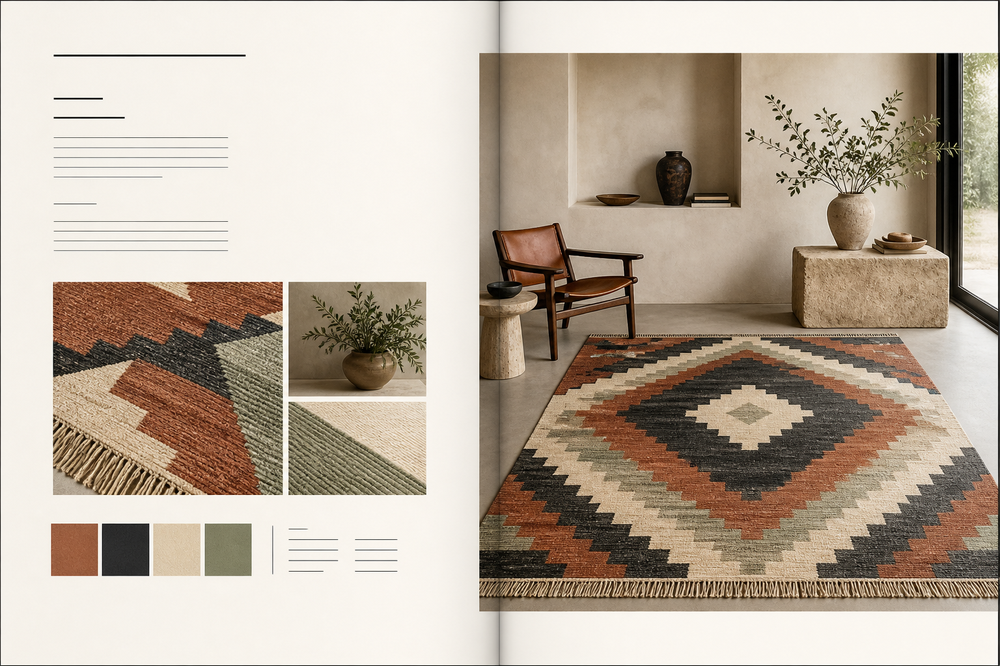
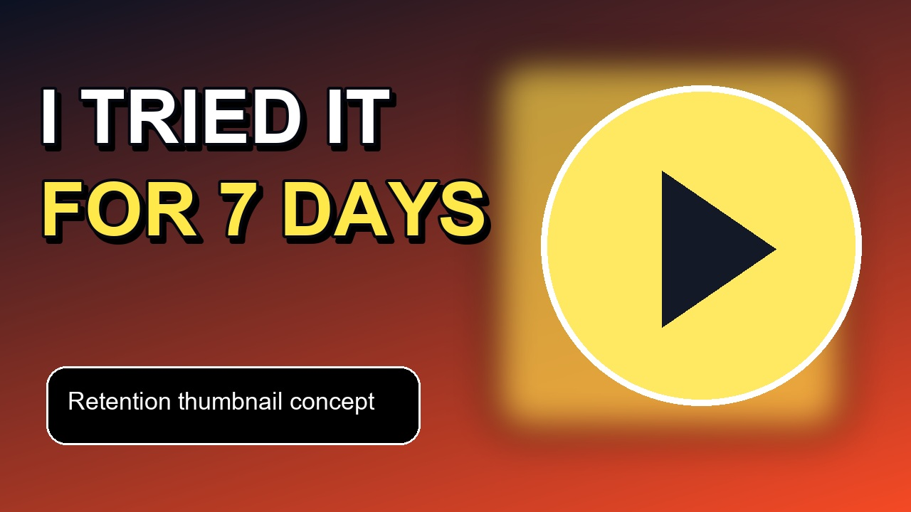
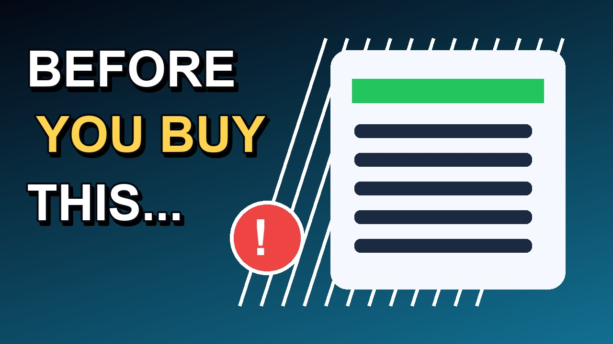
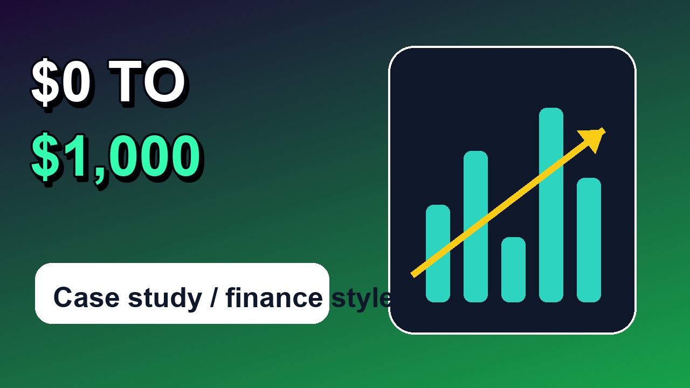
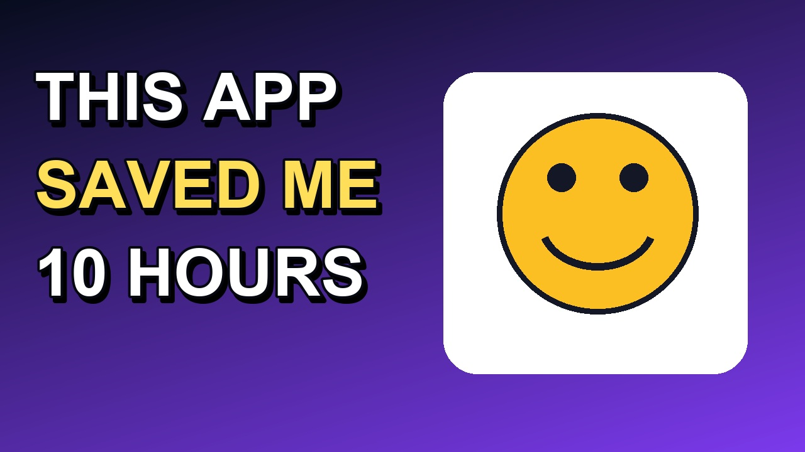

# Fast Visual Launch Kits

Quick-turn creative support for posters, launch graphics, YouTube thumbnails, and social media assets.

The repository also includes `n8n_lead_triage_sample.json`, a credential-free workflow sample that receives a lead, normalizes the payload, assigns a simple urgency tier, and returns structured JSON. It is intentionally a demo topology: no private credentials or third-party accounts are included.

## Paid Work Menu

- Poster concept: $45-$120 USD
- Thumbnail A/B pair: $20-$45 USD
- Launch graphics pack: $60-$180 USD
- Short-form social graphic: $10-$20 USD
- Spanish/English copy adaptation for thumbnails or ads: $8-$15 USD

Same-day turnaround is available for simple briefs when source assets are provided.

Available for quick paid test work:

- Poster and event artwork
- YouTube thumbnail concepts
- Short-form social media graphics
- Basic ad creatives
- Spanish/English copy adaptation
- Fast turnaround edits

Contact: open a GitHub issue here:

https://github.com/ErguLan/quick-thumbnail-portfolio/issues/new

## Samples

